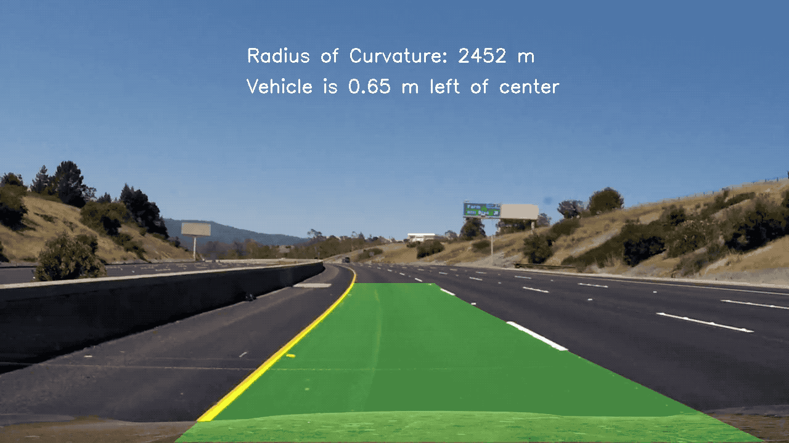

## Writeup Template

### You can use this file as a template for your writeup if you want to submit it as a markdown file, but feel free to use some other method and submit a pdf if you prefer.

---

**Advanced Lane Finding Project**

The goals of this project is to provide an method to reliably detect lanes in a video.
The techniques used in this project include:

1. Compute the camera calibration matrix and distortion coefficients given a set of chessboard images.
2. Apply a distortion correction to raw images.
3. Segment the lanes using a combination of gradients, and color thresholds
4. Apply a perspective transform to rectify binary image ("birds-eye view").
5. Detect lane pixels and fit to find the lane boundary.
6. Determine the curvature of the lane and vehicle position with respect to center, 
to implement a sanity check for the fitted lanes.
7. Warp the detected lane boundaries back onto the original image.

The code is organized as follows:

- To camera parameters were produced with the notebook  `Camera Calibration.ipynb`  which saves a pickle `calibration.p` 
with the fitted parameters
- The code for the segmentation and lane fitting pipeline is organized in the library `carnd_lane_pipeline`. 
  In this  library the class `LaneFinder` takes care of the fit and the image processing for each frame of the video.
- The results of the project is the video `output.mp4` which can be obtained by running the ipython notebook `Project Submission.ipynb`

[//]: # (Image References)

[image0]: output_images/chessboard_distortion.png "Chessboard"
[image1]: output_images/undistorted.png "Undistorted"
[image2]: output_images/segmentation.png "Undistorted"
[image3]: output_images/beye.png "Undistorted"
[image4]: output_images/lane_finder.png "Undistorted"

### Camera Calibration
The code for this step is contained in the notebook `Camera Calibration.ipynb`  

I start by preparing "object points", which will be the (x, y, z) coordinates of the chessboard corners in the world. Here I am assuming the chessboard is fixed on the (x, y) plane at z=0, such that the object points are the same for each calibration image.  Thus, `objp` is just a replicated array of coordinates, and `objpoints` will be appended with a copy of it every time I successfully detect all chessboard corners in a test image.  `imgpoints` will be appended with the (x, y) pixel position of each of the corners in the image plane with each successful chessboard detection.  

I then used the output `objpoints` and `imgpoints` to compute the camera calibration and distortion coefficients using the `cv2.calibrateCamera()` function.  I applied this distortion correction to the test image using the `cv2.undistort()` function and obtained this result: 

![alt text][image0]

### Pipeline (single images)

The image pipeline is applied in the notebook `Project Submission.ipynb` and the function `process_image` of the class `LaneFitter`

#### 1. Undistort
The first step of the lane finding pipeline is undistort the image using the fitted camera parameters.
To this end the camera paramters (distortion matrix) where saved in a pickled file `calibration.p` and are applied
using the function `cv2.undistort`. The result on a test image is the following:

![alt text][image1]

#### 2. Segmentation
The first step of the lane finding pipeline is to produce a binary image to which highlights the lanes (segmentation).

To this end I used a combination of different thresholds, which are implemented  in the function `segmentation` 
of the file `cardn_lane_pipeline.py`

- Directional Sobel thresholds
- Gradient Magnitude Threshold
- S channels (from HSV color space) thresholds

The parameters for these thresholds where either manually tuned on the test images or found reading blogs in the internet.
It greately improved the results to include a preprocessing step where the initial images are filtered with Gaussian 
of large sigme (1) in order to reduce noise in the produced binary segmentation. The binary segmentations the different 
thresholds were combined using an `OR` operator. Finally combined segmentation was set to zero outside of a trapezoidal region of 
interest in order to remove distracting objects.

To demonstrate this step, here is the result of the segmentation of a test image:

![alt text][image2]

#### 3. Perspective transform (Bird's Eye Projection)

The code for my perspective transform can be found function `corners_unwarp` , which appears in the file `carnd_lane_pipeline.py` 
The function takes as inputs an image (`img`) and gives back the warped image and the transformation and inverse transformation matrix 

Following the suggestion from Udacitym chose the hardcode the source and destination points in the following manner

| Source        | Destination   | 
|:-------------:|:-------------:| 
| 585, 460      | 320, 0        | 
| 203, 720      | 320, 720      |
| 1127, 720     | 960, 720      |
| 695, 460      | 960, 0        |

The result of this transformation applied to the test images is the following

![alt text][image3]

#### 4. Lane fitting

I used the perspective transformed image to fit the lane lines using a polynomial fit of second order.
This is inmplemetned in the function `_fit_lanes` of the class `LaneFinder`. 

The assumption is that we need to find 2 lanes, and to this end we use a window approach to identify 2 set of anchor points.
We scan the histogram of the binary image in windows to identify the anchor points and finally we fit a
second order polinomial to them. In order to get a more robust fit I perform the scan three times with diferent paramters
for the windows size and the average across the multiple points obtained.

The code is organized into a class which remembers where the last fits for the lane lanes and smooth the fits across time
implementing a quality check for the fit based on the curvature radius.

The result for this step on the test images are

![alt text][image4]

---

### Discussion

The particular challenge in this video is to detect the right lane, since it is a striped line, while the left lane is more or less detected accurately.
As a result the right lane appears to wiggle much more than the left one and sometimes shows the wrong curvature.
For this reason, I only used the left lane to calculate the curvature. 

It should be possible to use the fact that the lanes must be parallel to ensure a more robust procedure when 
fitting the lane polynomials, and use the left lane fit as a prior for the right lane.